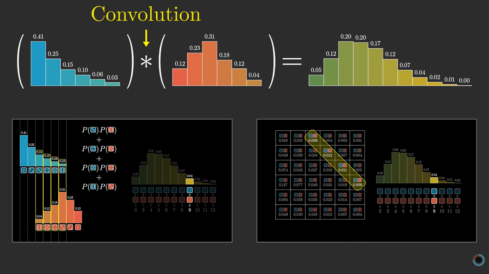
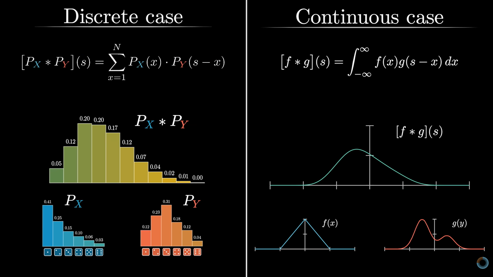

## Day 17: Convolutions and Adding Random Variables

🚀 Day 17 of the 111 Days of Learning challenge is complete!
Today I explored why adding random variables creates surprisingly complex behavior:

🔄 Convolution: How distributions combine when variables are added.
➕ Discrete Case: Diagonal slices and the flip-and-slide method.
🌊 Continuous Case: Extending the same idea to smooth distributions.
🎯 Uniform Distribution Example: How simple inputs create new shapes.
🔗 Connection to CLT: Why repeated addition leads to normal distributions.
This made combining randomness feel both messy and beautifully structured.

## Notes & Screenshots
- 
- 

@CodeForChangeNp #CodeForChange #111DaysOfLearningForChange #Day17LearningForChange