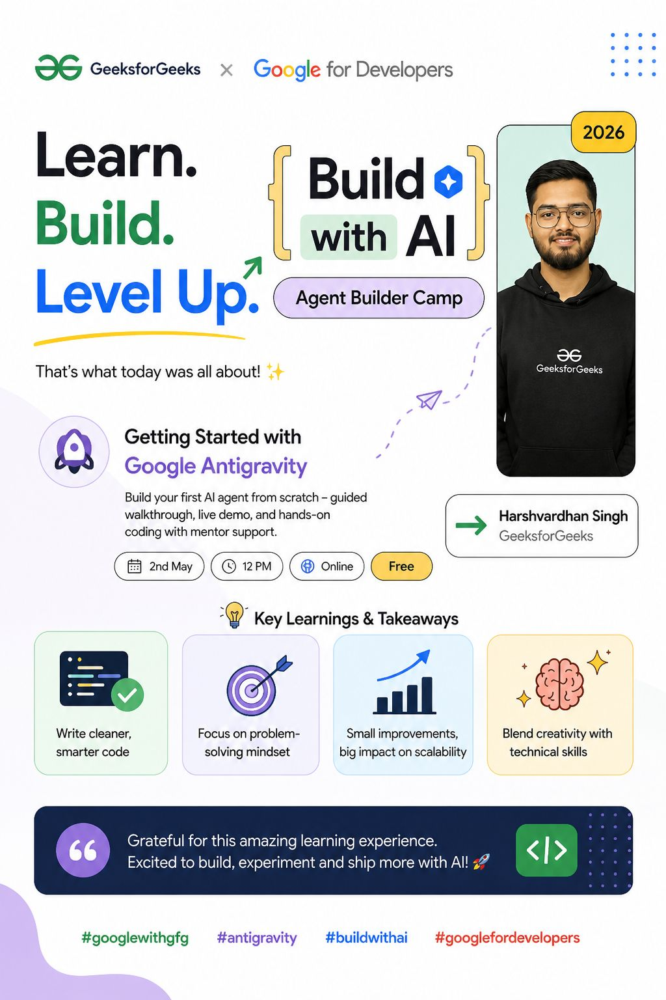

# Day 20: Build With AI Camp and RAG Agent Deployment

**🚀 Day 20 of the 111 Days of Learning challenge is complete!**

Today I leveled up at the Build With AI Camp and built a RAG-based AI agent using Google Antigravity and vibe coding:

- 🤖 **RAG Pipeline:** How retrieval and generation work together to answer questions from documents.
- 🛠️ **Google Antigravity:** How to build and deploy an AI agent with guided tooling.
- 🚀 **Deployment:** How to turn an AI project into a live app.
- 🧩 **Debugging and Environment Fixes:** How solving setup issues is part of the build process.

Project link: [Chat with PDFs](https://chat-with-pdfs-1089561486101.us-central1.run.app/app)

This made building AI agents feel practical, modern, and exciting. 💡

## Notes & Screenshot
- 

@CodeForChangeNp #CodeForChange #AIAgents #GoogleDevs #GFG #111DaysOfLearning
