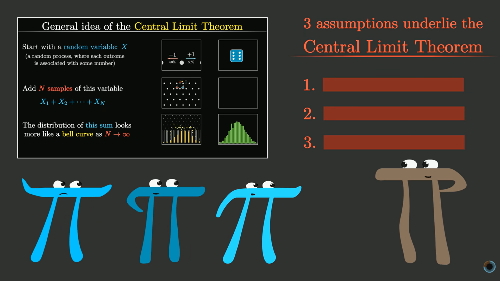
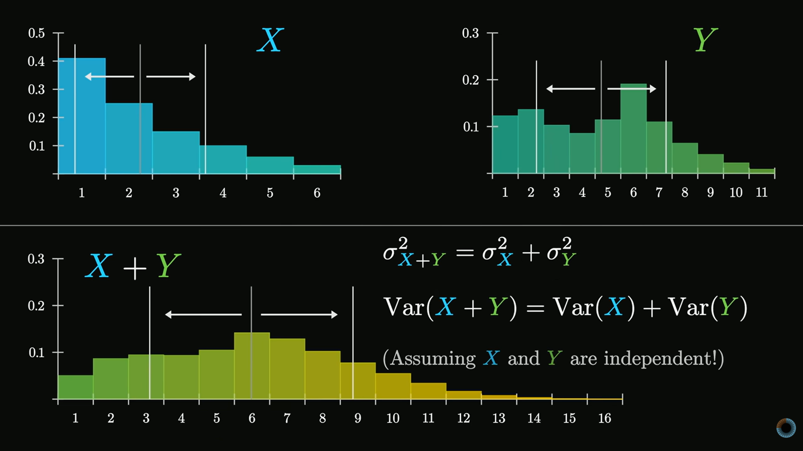

# Day 15: Central Limit Theorem

** 🚀 Day 15 of the 111 Days of Learning challenge is complete!

Today I explored one of the most powerful ideas in statistics — how randomness becomes predictable:

🎯 Central Limit Theorem: Why sums and averages tend toward a normal distribution.
⚙️ Galton Board Intuition: How simple randomness builds structured patterns.
🎲 Dice Simulations: Seeing distributions emerge from repeated experiments.
📊 Mean, Variance, Standard Deviation: How they define the shape of distributions.
🔍 Underlying Assumptions: When and why the theorem works.

This made randomness feel much more structured and understandable. 💡

## Notes & Screenshots
- 
- 

@CodeForChangeNp #CodeForChange #111DaysOfLearningForChange #Day15LearningForChange