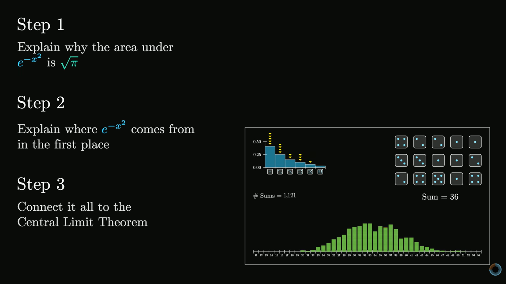
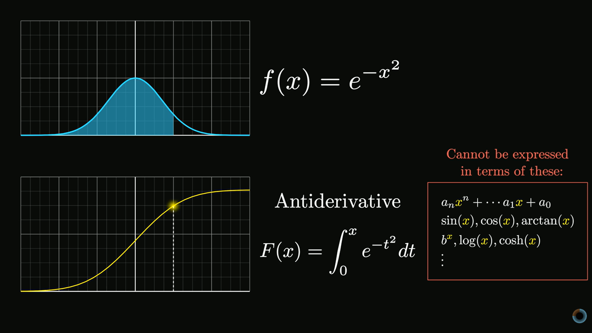

## Day 16: Why π is in the Normal Distribution

🚀 Day 16 of the 111 Days of Learning challenge is complete!
Today I explored a deeper reason behind the appearance of π in the normal distribution:
🔢 Classic Proof: Understanding the traditional integral-based approach.
🧭 Herschel–Maxwell Derivation: How symmetry and independence lead to the Gaussian form.
🔄 Rotational Symmetry: Why geometry plays a key role in probability.
🧠 Conceptual Insight: Moving beyond memorization to true understanding.
This made the connection between geometry and probability feel truly elegant. 💡

## Notes & Screenshots
- 
- 

@CodeForChangeNp #CodeForChange #111DaysOfLearningForChange #Day16LearningForChange